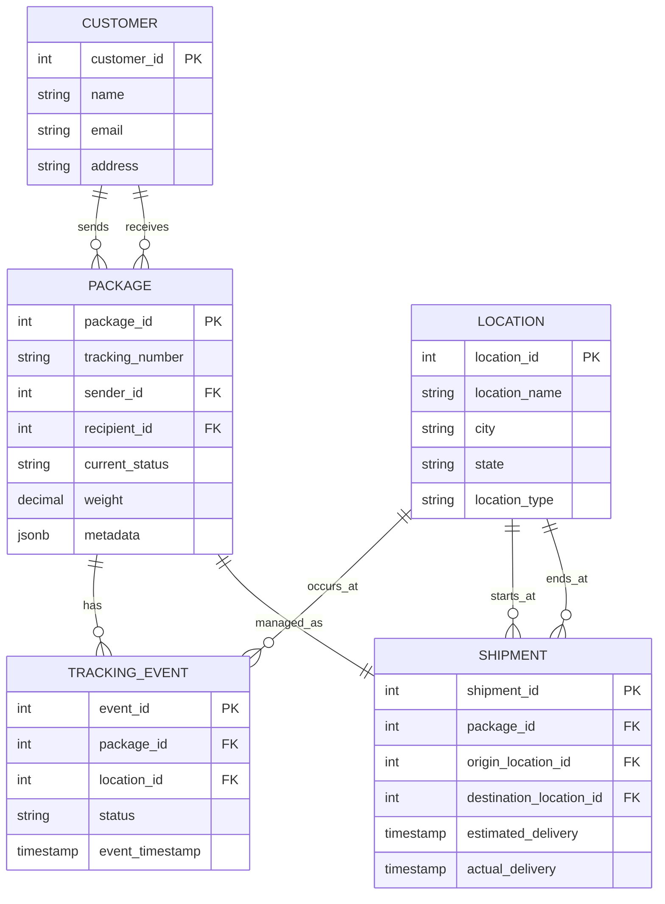

# Logistics and Shipment Tracking Backend

Backend data service for a shipment tracking company using PostgreSQL, Redis, and MongoDB.

## ER Diagram



## Setup

1. **Prerequisites**: Docker, Poetry, Python 3.11+
2. **Start Databases**:
   ```bash
   docker-compose up -d
   ```
3. **Install Dependencies**:
   ```bash
   poetry install
   ```

## Schema Explanation

The PostgreSQL database follows the **Third Normal Form (3NF)**:

- **Customers**: Stores distinct user info.
- **Locations**: Centralizes warehouse/hub details to avoid data duplication.
- **Packages**: Contains core shipment details, including a `JSONB` column for flexible metadata (e.g., "fragile").
- **Shipments**: Explicitly links origin and destination hubs.
- **TrackingEvents**: Normalized history log, referencing packages and locations.

## Performance Tuning Report

_(To be updated after Milestone 4)_
