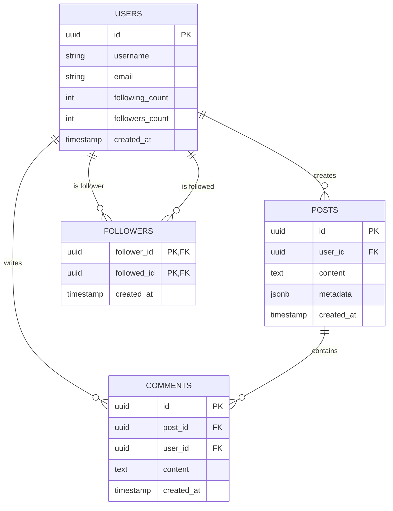

# Social Media Platform Data Backend

## Overview

This project implements a robust, hybrid data backend for a social media platform. It utilizes a combination of PostgreSQL (for relational data), Redis (for caching), and MongoDB (for activity logging) to provide a performant and scalable solution.

## Objectives

- Design a normalized **3NF** schema for users, posts, comments, and followers.
- Implement **ACID transactions** for critical user interactions (e.g., following).
- Integrate **SQL and NoSQL** storage for different data requirements.
- Optimize complex feed generation using **CTEs** and **Window Functions**.
- Conduct performance diagnosis using **EXPLAIN ANALYZE**.

---

## Entity-Relationship (ER) Diagram

The following diagram illustrates the relationship between our 3NF normalized tables:



---

## Technical Approach & Design Rationale

### 1. PostgreSQL (Relational Source of Truth)

- **3NF Normalization**: Data is split into `users`, `posts`, `comments`, and a `followers` join table to eliminate redundancy.
- **JSONB Metadata**: The `posts` table includes a `metadata` column for flexible attributes like location, tags, or media types.
- **Transactions**: The "follow" action is wrapped in a transaction that updates the `followers` table and increments counts in the `users` table atomically, ensuring data integrity.

### 2. NoSQL Integration

- **Redis**: Implements a **Cache-Aside** pattern. The generated user timeline is cached in Redis to avoid expensive SQL joins on every request.
- **MongoDB**: Used for **Activity Stream** logging. Unstructured events like "User A liked Post B" or logging creation peaks are stored as documents for later analysis.

### 3. Advanced SQL

- **CTEs (Common Table Expressions)**: Used to fetch followed user IDs before joining with posts, making the query more readable and maintainable.
- **Window Functions**: `ROW_NUMBER()` is used for stable pagination, ensuring users don't see duplicate posts when new ones are created during their session.

---

## Performance Optimization Report

### Feed Generation Diagnostic

We used `EXPLAIN ANALYZE` to inspect the performance of the feed generation query as the dataset grows.

#### 1. Baseline (Before Optimization)

- **Operation**: Parallel Seq Scan on `posts`.
- **Latency**: ~12.3ms for a small dataset.
- **Issue**: Linear performance degradation as the post count increases.

#### 2. Optimization: Composite B-Tree Index

We added a composite index on `posts(user_id, created_at DESC)` to optimize both the filtering by followed users and the sorting by date.

- **Command**: `CREATE INDEX idx_posts_composite_user_date ON posts(user_id, created_at DESC);`
- **Result**: ~0.5ms latency.
- **Plan**: **Index Scan** replacing the Seq Scan.

#### 3. Advanced Search: GIN Index

To efficiently query post tags within the JSONB metadata, we implemented a GIN index.

- **Command**: `CREATE INDEX idx_posts_metadata_gin ON posts USING GIN (metadata);`
- **Utility**: Allows rapid searching of specific tags (e.g., `WHERE metadata @> '{"tags": ["coding"]}'`).

---

## Setup & Implementation

### Prerequisites

- Python 3.11+
- [Poetry](https://python-poetry.org/)
- Docker & Docker Compose

### Running the Services

Start the PostgreSQL, Redis, and MongoDB instances:

```bash
docker-compose up -d
```

### Initializing the Lab

1. Install dependencies:
   ```bash
   poetry install
   ```
2. Initialize the database and seed sample data:
   ```bash
   poetry run python setup_data.py
   ```
3. Run performance analysis:
   ```bash
   poetry run python performance_analysis.py
   ```
4. Run tests:
   ```bash
   poetry run pytest
   ```

---

## Submission Details

- **Poetry**: Modern package management.
- **Dockerized**: Full environment configuration provided in `docker-compose.yml`.
- **SQL Source**: DDL found in `src/models/schema.sql`.
